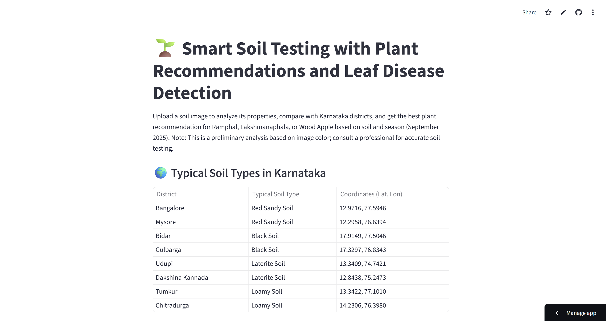
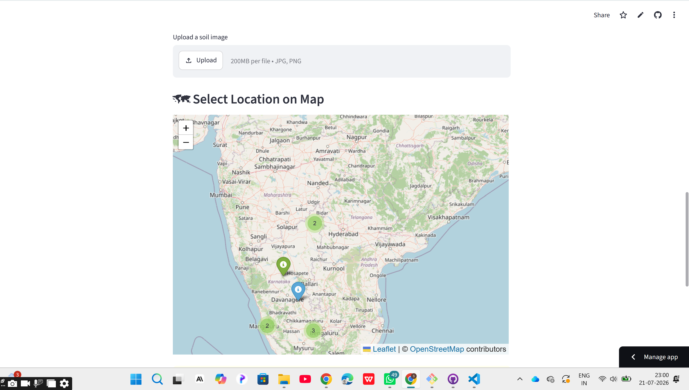
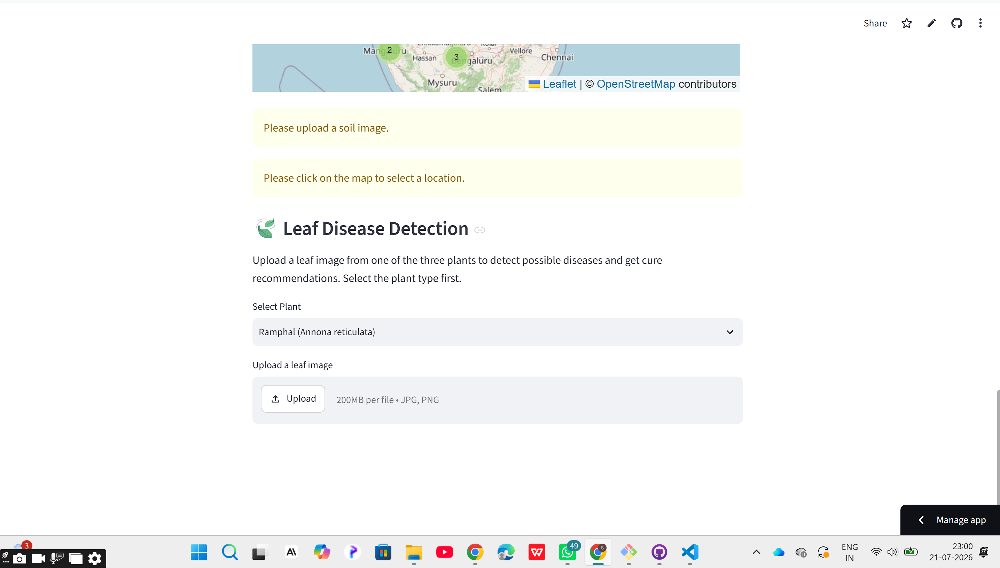

# 🌱 Smart Soil Testing with Plant Recommendations and Leaf Disease Detection

An AI-powered web application that analyzes soil images, recommends suitable indigenous fruit crops, and detects leaf diseases using Deep Learning.

---

## 📖 Overview

This project helps farmers identify suitable indigenous fruit crops based on soil characteristics and location. It also detects leaf diseases from uploaded images and provides treatment recommendations.

The application promotes sustainable agriculture by encouraging the cultivation of indigenous fruit crops like:

- 🌿 Ramphal (*Annona reticulata*)
- 🌿 Lakshmanaphala (*Annona muricata*)
- 🌿 Wood Apple (*Limonia acidissima*)

---

## ✨ Features

- 📷 Soil Image Analysis
- 🌍 Karnataka District Soil Comparison
- 📍 Interactive Location Selection
- 🌱 Smart Plant Recommendation
- 🍃 Leaf Disease Detection
- 💊 Disease Cure Suggestions
- 📊 User-Friendly Streamlit Interface

---

## 🧠 AI Features

- Image Processing
- CNN-based Leaf Disease Detection
- Soil Analysis
- AI-based Crop Recommendation
- Seasonal Crop Recommendation

---

## 🛠 Tech Stack

### Frontend
- Streamlit

### Backend
- Python

### AI & ML
- TensorFlow
- Keras
- OpenCV

### Libraries
- NumPy
- Pandas
- Pillow
- Geopy
- Scikit-learn

### Tools
- Git
- GitHub
- VS Code

---

## 📂 Project Structure

```
soil_app_project/
│
├── soil_app.py
├── app_info.py
├── disease_detection.py
├── requirements.txt
├── README.md
├── models/
├── images/
└── screenshots/
```

---

## 🚀 Installation

Clone the repository

```bash
git clone https://github.com/shrinivasmattur/soil_app_project.git
```

Go to project folder

```bash
cd soil_app_project
```

Create virtual environment

```bash
python -m venv venv
```

Activate virtual environment

Windows

```bash
venv\Scripts\activate
```

Install dependencies

```bash
pip install -r requirements.txt
```

Run the application

```bash
streamlit run soil_app.py
```

---

## 📷 Screenshots

### Home Page



### Soil Analysis



### Plant Recommendation


### Leaf Disease Detection



---

## 🎥 Demo Video

Add your video link here

```
https://youtu.be/your-video-link
```

---

## 🌐 Live Demo

 Streamlit Cloud link

```
[https://your-app.streamlit.app](https://soilappproject-c3xmm5jp4osnpoc6mg5rby.streamlit.app/)
```

---

## 📈 Future Enhancements

- AI Chatbot for farmers
- Live Weather API Integration
- Market Price Prediction
- Fertilizer Recommendation
- Mobile Application
- Multi-language Support
- AI Agent for Personalized Farming Advice

---

## 👨‍💻 Developer

**Shrinivas Mattur**

Information Science & Engineering

National Institute of Engineering (NIE), Mysuru

---

## 📄 License

This project is developed for educational and hackathon purposes.


